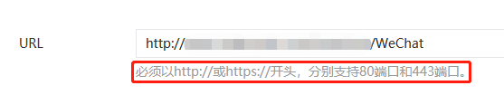
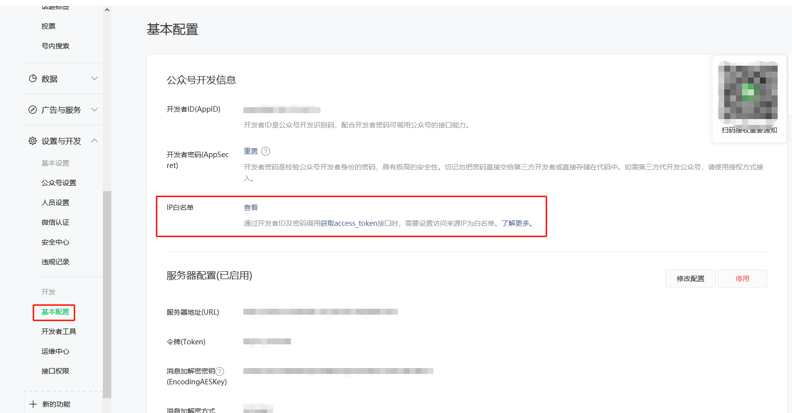
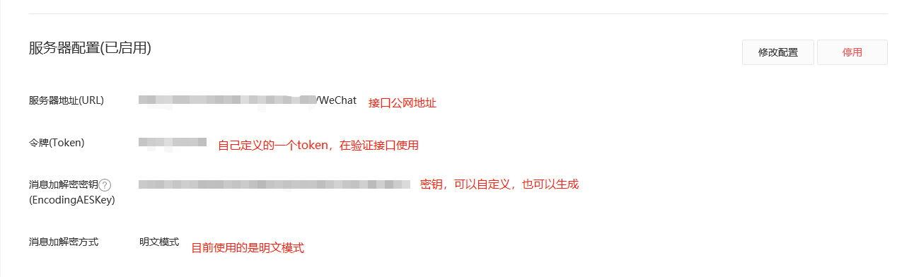

# 微信公众号开发

微信公众平台：https://mp.weixin.qq.com/

微信开发文档：https://developers.weixin.qq.com/doc/offiaccount/Getting_Started/Overview.html

## 简单开发流程

### 微信公众号服务器

首先微信所有接口需要带上access_token参数，access_token可以通过接口获取（https://api.weixin.qq.com/cgi-bin/token?grant_type=client_credential&appid=APPID&secret=APPSECRET ），所以微信接口调用不需要配置公众号服务器，但是还是需要配置ip白名单。

微信支持数据推送功能，比如用户关注取关，用户点击菜单，用户发送信息等，都会由微信给公众号后台发送消息。所以后台程序需要一个接口来处理 **所有的** 推送消息，而且需要保证这个接口可以被外网访问(该ip下的端口可以访问)。这个功能是需要配置后台服务器的。

##### 如何配置后台服务器？

<center><b>注意后台程序的端口必须是80或443</b></center>



1.写一个get请求的接口完成消息验证，详情可见https://developers.weixin.qq.com/doc/offiaccount/Basic_Information/Access_Overview.html#%E7%AC%AC%E4%BA%8C%E6%AD%A5%EF%BC%9A%E9%AA%8C%E8%AF%81%E6%B6%88%E6%81%AF%E7%9A%84%E7%A1%AE%E6%9D%A5%E8%87%AA%E5%BE%AE%E4%BF%A1%E6%9C%8D%E5%8A%A1%E5%99%A8。

代码示例(这里使用的是明文模式)：

```java
@RequestMapping(method = RequestMethod.GET,value = "/WeChat")
@ResponseBody
public String validate(String signature,String timestamp,String nonce,String echostr){
    List<String> arr = Arrays.asList(timestamp,nonce, WeChatRegistry.TOKEN);
    arr.sort(String::compareTo);
    String encodeStr = arr.stream().collect(Collectors.joining());
    if(SecurityUtil.sha1Encode(encodeStr).equals(signature)) return echostr;
    return null;
}
```

2.同地址下需要一个post请求的接口来完成消息处理

```java
@RequestMapping(method = RequestMethod.POST,value = "/WeChat")
public void handleMessage(@RequestBody ReceiveMsg msg, HttpServletResponse response) {
    WeChatContext.dispatch().doHandler(msg, response);
}
```

3.保证这个接口(程序)可以被外网访问到。

若为个人电脑，可以使用内网穿透，将自己的ip代理到一个公网地址使之可以被访问到。常用的内网穿透软件有ngrok（国外）、natapp（基于ngrok，国内）。

若为云服务器，则是它的公网ip，记得开放端口。

需要注意的是如果是443端口使用https协议，则内网穿透需要换成https协议的代理，如果是服务器需要购买SSL证书(可以自己签发无效证书，然后使用nginx来代理https协议，但是微信要求必须使用可信任SSL证书，所以这种方式虽然可以让外网使用https协议访问，但不能用于公众号服务器)。

4.添加IP白名单，个人电脑就是公网ip，这里提供一个查询地址https://www.ip138.com/ 。服务器就是公网ip。若要配置多个白名单，使用换行分割。



5.配置服务器



在提交配置时会进行一次验证接口的验证，此时可以判断自己的服务器的状态。如果配置成功，则说明微信已经调用了你配置的后台服务完成了验证，接下来就可以接收消息了。

### Quick Start

##### 1.配置基本开发信息

```properties
#开发者ID(AppID)
weixin.appid=AppID
#开发者密码(AppSecret)
weixin.secret=AppSecret
#消息加解密密钥(EncodingAESKey)
weixin.EncodingAESKey=EncodingAESKey
#令牌(Token)
weixin.token=Token
#token刷新时间
weixin.TokenLastMinutes=100
```

##### 2.微信接口调用

使用WeChatContext.api()接口模块完成接口调用。

样例：

```java
//发送模板消息
WeChatContext					//微信核心容器
    .api()						//微信接口模块
    .template()					//模板消息模块
    .sendTemplate(template);	//发送模板消息接口
//查询所有模板
WeChatContext
    .api()
    .template()
    .getTemplate();
//查询菜单信息
WeChatContext
    .api()
    .menu()
    .getMenu();
```

##### 3.接收消息功能

(一).继承`DefaultHandler`实现`doHandler(ReceiveMsg msg, HttpServletResponse response)`方法

```java
public class TextHandler implements DefaultHandler {
    @Override
    public void doHandler(ReceiveMsg msg, HttpServletResponse response) {
        SendMsg sendMsg=new SendMsg(msg);
        sendMsg.setContent("您好，欢迎关注本公众号!");
        sendMsg.setMsgType(MsgType.TEXT.getType());
        XMLUtil.writeXmlToResponse(sendMsg,SendMsg.class,response);
    }
}
```

(二).在配置类中配置handler

继承ConfigAdapter，实现`config()`方法，**注意加上`@Component`注解**

要选择MsgType中对应的消息类型

```java
@Component
public class WeChatConfig extends ConfigAdapter {

    @Autowired
    private TextHandler textHandler;

    @Override
    public void config(){
        WeChatContext.config()
                .configMsgHandler()
                .setHandler(textHandler, MsgType.TEXT);
    }

}
```

##### 4.项目默认使用内存完成access_token的管理

**建议使用持久化存储如数据库，redis等**

数据库存储示例：

表结构：

```sql
CREATE TABLE wechat_token (
  access_token varchar(255),
  expire_time datetime
)
```

继承TokenRepository，实现get和store方法

```java
@Component
public class JDBCRepository implements TokenRepository {

    @Autowired
    private TokenDao tokenDao;

    @Override
    public AccessToken get() {
        return tokenDao.queryAccessToken();
    }

    @Override
    public void store(AccessToken accessToken) {
        tokenDao.updateAccessToken(accessToken.getAccessToken(),accessToken.getExpireTime().toLocalDateTime().format(DateTimeFormatter.ofPattern("yyyy-MM-dd HH:mm:ss")));
    }

}
```

```sql
select access_token as accessToken,expire_time as expireTime from wechat_token
```

```sql
update wechat_token set access_token=#{token},expire_time=#{expire}
```

然后在配置中添加：

```java
WeChatContext.config()
        .configCommon()
        .setTokenRepository(jDBCRepository);//自定义token存储方式
```

## wiki

### <span id="config">配置</span>

**ConfigAdapter**    配置启动类

用于**项目启动时**完成相关配置

使用：新建配置类继承`ConfigAdapter`，加上`@Component`注解。重写`config()`方法，方法中调用`WeChatRegistry`中的配置方法。

使用样例：

```java
@Component
public class WeChatConfig extends ConfigAdapter {

    @Autowired
    private TextHandler textHandler;
    @Autowired
    private EventHandler eventHandler;

    @Override
    public void config(){
        WeChatContext.config()
                .configMsgHandler()
                .setHandler(textHandler, MsgType.TEXT)
                .setHandler(eventHandler, MsgType.EVENT);
    }

}
```

**WeChatRegistry**	配置中心

用于微信功能配置，可以在运行时动态更改配置，但是不建议这么做。

完整配置样例：

```java
WeChatContext//核心容器
        .config()//进行配置操作
            .configCommon()//基础配置
                .setAppID(appid)//开发者id
                .setSecret(secret)//开发者密码
                .setToken(token)//token令牌
                .setEncodingAESKey(EncodingAESKey)//密钥
                .setTokenLastMinutes(TokenLastMinutes)//token持续时间
                .setTokenRepository(myRepository)//token存储方式
        .and()//继续进行其他配置
            .configApi()//微信接口相关配置
                .setAfterProcessor(afterProcessor)//接口前置处理
                .setPreProcessor(preProcessor)//接口后置处理
        .and()//继续进行其他配置
            .configMsgHandler()//消息接收配置
                .setHandler(imgHanler,MsgType.IMAGE)//配置图像接收处理方法
    			.setHandler(textHandler,MsgType.TEXT)//配置文字接收处理方法
                .setExceptionHandler(exHandler,ExHandler.class);//配置异常处理
```

### token存储

**TokenRepository**	token仓库

get()：从仓库中获取access_token

store(AccessToken accessToken)：将access_token存储至仓库

若需自定义仓库，继承并实现这两个方法，并完成token仓库[配置](#config)。

jdbc存储样例：

```java
@Component
public class JDBCRepository implements TokenRepository {

    @Autowired
    private WeChatDao weChatDao;

    @Override
    public AccessToken get() {
        return weChatDao.queryAccessToken();
    }

    @Override
    public void store(AccessToken accessToken) {
        weChatDao.updateAccessToken(accessToken.getAccessToken(),accessToken.getExpireTime().toLocalDateTime().format(DateTimeFormatter.ofPattern("yyyy-MM-dd HH:mm:ss")));
    }

}
```

### api增强

针对微信接口调用，提供了前后置处理，分别是`ApiPreProcessor`和`ApiAfterProcessor`，对应了方法`void doProcessor(URLBuilder builder)`和`void doProcessor(URLBuilder builder, APIResult result)`。目前并没有做微信接口的异常处理，因为一般这里只有http请求的异常。

现在默认使用的前置处理不做任何事情。默认使用的后置处理是`AutoRefreshProcessor`。当识别到接口调用失败，且为access_token相关错误时，会自动去调用获取access_token的接口，并完成token刷新。建议自定义后置增强时，继承`AutoRefreshProcessor`并在`void process(URLBuilder builder,APIResult result)`中实现自定义后置处理方法。

### 消息处理

**DefaultHandler**	默认消息处理器

默认处理逻辑:

```java
default void doHandler(ReceiveMsg msg, HttpServletResponse response){
    SendMsg sendMsg=new SendMsg(msg);
    sendMsg.setMsgType(MsgType.TEXT.getType());
    sendMsg.setContent("服务开发中~请耐心等候哦~");
    XMLUtil.writeXmlToResponse(sendMsg,SendMsg.class,response);//转xml格式并写入实体
}
```

若要自定义处理逻辑请继承并实现`doHandler`方法，并完成[配置](#config)，注意配置时要指明消息类型(MsgType)。

**由于微信要求返回格式为XML类型，所以要注意将实体写入response时要转为xml格式。**

自定义文字类型消息处理：

```java
public class TextHandler implements DefaultHandler {
    @Override
    public void doHandler(ReceiveMsg msg, HttpServletResponse response) {
        SendMsg sendMsg=new SendMsg(msg);
        sendMsg.setContent("您好，欢迎关注本公众号!");
        sendMsg.setMsgType(MsgType.TEXT.getType());
        XMLUtil.writeXmlToResponse(sendMsg,SendMsg.class,response);
    }
}
```

**DefaultEventHandler**	默认事件处理器

事件消息也是消息类型的一种，因为事件比较多且固定，所以事件类型单独拎出来处理。

根据想要处理的类型重写相应的方法(doSubscribe,doUnsubscribe...)，并完成[配置](#config)即可。

**注意事件处理的doHandler方法是做方法转发用的，一般不进行重写。**

**DefaultExceptionHandler**	默认异常处理器

```java
public interface DefaultExceptionHandler {

    default void handleException(ReceiveMsg msg, HttpServletResponse response, Exception ex){
        SendMsg sendMsg=new SendMsg(msg);
        sendMsg.setMsgType(MsgType.TEXT.getType());
        sendMsg.setContent("微信公众号异常,请稍后再试");
        XMLUtil.writeXmlToResponse(sendMsg,SendMsg.class,response);
    }
}
```

由于消息处理用户自定义逻辑会比较多，所以做了异常处理。

自定义异常处理步骤：

1.自定义微信异常(也可以直接使用现有异常)

```java
public class WeChatException extends Exception {
    public WeChatException() {
    }

    public WeChatException(String message) {
        super(message);
    }

    public WeChatException(String message, Throwable cause) {
        super(message, cause);
    }

    public WeChatException(Throwable cause) {
        super(cause);
    }
}
```

2.在消息处理其中抛出异常

```java
public class MyHandler implements DefaultHandler {
    @Override
    public void doHandler(ReceiveMsg msg, HttpServletResponse response) throws Exception{
        throw new WeChatException();
    }
}
```

3.自定义异常处理

```java
public class MyExceptionHandler implements DefaultExceptionHandler {
    @Override
    public void handleException(ReceiveMsg msg, HttpServletResponse response, Exception ex) {
        SendMsg sendMsg=new SendMsg(msg);
        sendMsg.setMsgType(MsgType.TEXT.getType());
        sendMsg.setContent("微信公众号出了自定义异常，请稍后重试");
        XMLUtil.writeXmlToResponse(sendMsg,SendMsg.class,response);
    }
}
```

4.在`ConfigAdapter`中完成[配置](#config)

```java
@Override
public void config(){
    WeChatContext.config()
            .configMsgHandler()
            .setHandler(new MyHandler(), MsgType.TEXT)
            .setExceptionHandler(new MyExceptionHandler(), WeChatException.class);
}
```

### 目前支持api

#### 基础功能

获取access_token

#### 菜单模块

创建自定义菜单

查询自定义菜单

删除自定义菜单

#### 用户模块

获取用户详情

获取关注者openid

#### 模板消息模块

获取所有模板信息

删除模板

发送模板消息

## 后续开发

### 增加api

由于时间有限，目前只完成了一部分接口的支持，如果后续需要使用没有适配的接口，可以按照如下步骤完成接口配置：

1.在`WeChatAPI`中完成api的基础配置

```java
ACCESS_TOKEN("https://api.weixin.qq.com/cgi-bin/token?grant_type=%s&appid=%s&secret=%s",WeChatConstant.GET,"基础功能","ACCESS_TOKEN","grant_type&appid&secret", TokenJson.class);
//枚举变量(接口调用地址(参数记得换成%s),请求类型,所属模块,接口唯一标识(自定义,具有唯一性即可),参数集(使用&拼接),成功返回时的类)
```

2.在`ApiExecuteCenter`中定义相应的方法

```java
public <T> APIResult<T> accessToken(){
    URLBuilder builder=new URLBuilder(WeChatAPI.ACCESS_TOKEN);//使用枚举变量创建URLBuilder
    builder.setParam("grant_type","client_credential");//设置请求参数(access_token,secret,appid已经默认配,不需要额外设置)
    //builder.setPostData(template,SendTemplate.class);//若为post请求，使用该方法设置请求体内容
    return executor.executeProxy(builder,WeChatAPI.ACCESS_TOKEN.getResultClass());//调用请求方法 (URLBuilder,接口返回成功类)
}
```

两步操作即可完成一个简单get或post请求的配置

3.对于一些复杂请求，如需要传文件内容的接口，现在系统并没有做这样的处理，如果有这样的需求，最好也使用`URLBuilder`做处理，方便集中处理。

### 增加事件处理

若更改源码

1.在`WeChatConstant.EventType`中添加相应的事件类型

2.在`doHandler`中添加相应的支线

```java
case WeChatConstant.EventType.TEMPLATESENDJOBFINISH:doTemplateSendFinish(msg, response);break;
```

3.添加相应的处理方法`doXXX(ReceiveMsg msg, HttpServletResponse response)`

4.在继承的类中完成方法实现

若不更改源码，则重写`doHandler`方法，在`doHandler`中添加相应的支线，这里直接使用字符串匹配。然后在加上对应方法即可。

### 增加消息类型

在`MsgType`中增加相应的类型即可。

